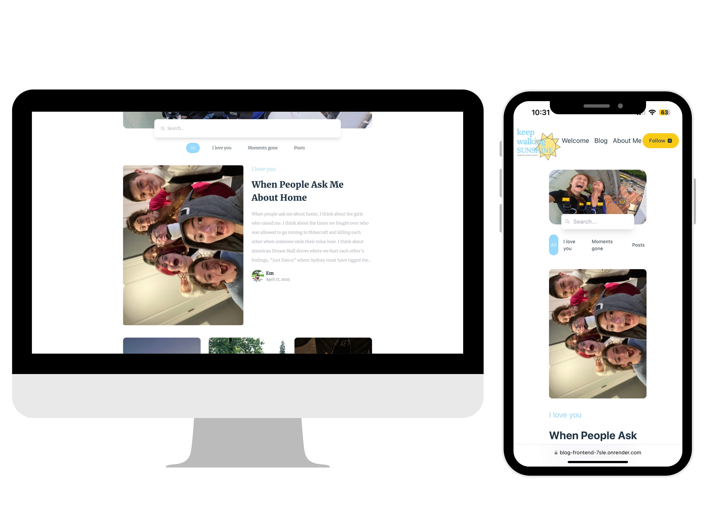
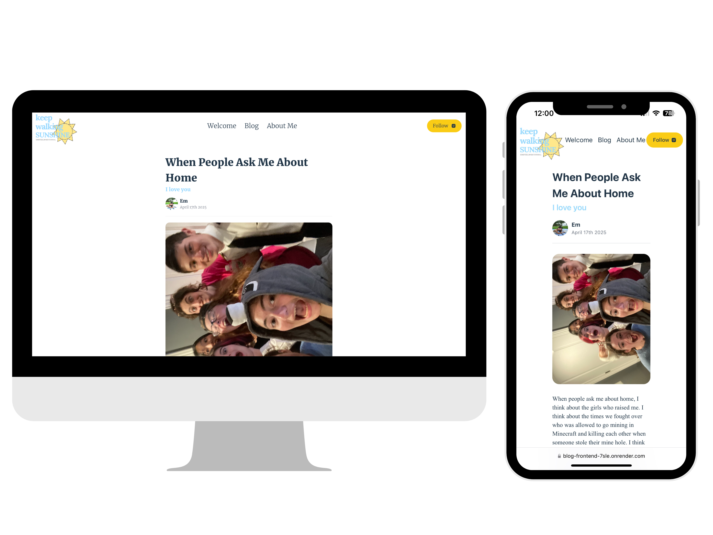

# My Personal Blog Site
(For mobile and computer use!)

## Overview
I created a database where I can keep all my personal anecdotes and feelings alive. At the core of it all, this is a collection of letters for people I have gotten to know and love. I am no one without love. I hope you find yourself in these.
[https://blog-frontend-7sle.onrender.com/#/](https://blog-frontend-7sle.onrender.com/#/) 

**“When People Ask Me About Home” Blog Details Page**

**Blog Page**

Technologies: React, Vite, TailwindCSS, Express, MongoDB, AXIOS

Infinite Photo Carousel Libraries: Swiperjs, react-simple-typewriter

Hosting Service: Render (frontend and backend)

Image Storage: Cloudinary

For more, check: https://iamemilyhan.notion.site/projects-experiences

## Continuation
For a continuation of my work, I made visualized storytelling versions for 3 of the stories on my blog. If you would like to check them out, click here:

1. **Product**: [Product Notion Page](https://www.notion.so/Storyteller-Introduction-1bb341677d6880649e2eea1368bea828?pvs=21) 
2. **When People Ask Me About Home**: [When People Ask Me About Home Notion Page](https://www.notion.so/New-Story-Home-53f341677d6883b6aed481659b8264c9?pvs=21) 
3. **I Am Em**: [I am Emily Han Notion Page](https://www.notion.so/I-am-Emily-Han-18c341677d68807f9723c1489d40608b?pvs=21) (video)
